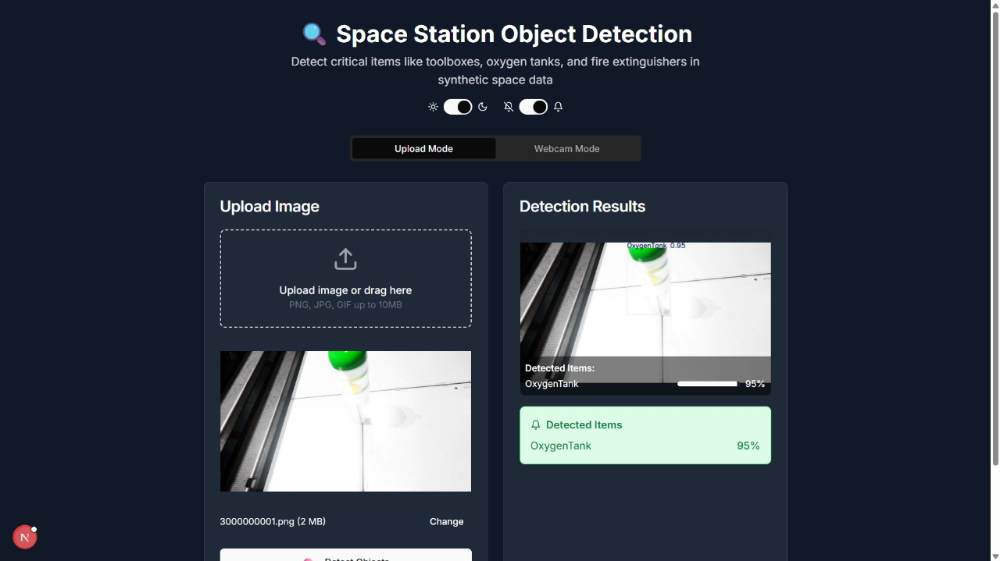

<div align="center">
  <br />
    <a href="https://github.com/Flaxmbot/TestModel.git" target="_blank">
      
    </a>
  <br />
  <div>
  <!-- Next.js -->


<!-- YOLO (custom badge since no official logo on shields.io) -->


<!-- Python -->


<!-- FastAPI -->


<!-- python-multipart (no logo, using generic Python) -->


  </div>
  <h3 align="center">Space Station Object Detection</h3>

</div>

## 📋 <a name="table">Table of Contents</a>

1. 🤖 [Introduction](#introduction)
2. ⚙️ [Tech Stack](#tech-stack)
3. 🔋 [Features](#features)
4. 🤸 [Quick Start](#quick-start)
5. 🕸️ [Snippets (Code to Copy)](#snippets)
6. 🔗 [Assets](#links)
7. 🚀 [More](#more)


## <a name="introduction">🤖 Introduction</a>

This project is a simulation-based object detection system designed to detect critical objects inside a space station environment. Built during a hackathon, the model is capable of identifying essential equipment under challenging conditions using computer vision and AI.

If you're getting started and need assistance or face any bugs, join our active developers community with over Team members. It's a place where people help each other out.


## <a name="tech-stack">⚙️ Tech Stack</a>

- Next js 
- Fast API
- Typescript
- Tailwind CSS
- Python
- YOLOv8

## <a name="features">🔋 Features</a>

### Features of the Travel Agency Project

👉 Real-time image detection using OpenCV and Python with live webcam integration

👉 Displays object name and detection accuracy with visual overlays

👉 Success notifications for correctly identified items with confidence thresholds

👉 Warning alerts for missing or unidentified critical objects

👉 Clean and responsive UI built for ease of interaction and real-time feedback

👉 Modular architecture with reusable Python components for detection pipelines

👉 Secure and scalable design built for integration with broader systems

and many more, built for scalability and a smooth user experience.

## <a name="quick-start">🤸 Quick Start</a>

Follow these steps to set up the project locally on your machine.

**Prerequisites**

Make sure you have the following installed on your machine:

- [Git](https://git-scm.com/)
- [Node.js](https://nodejs.org/en)
- [npm](https://www.npmjs.com/) (Node Package Manager)
- [python](https://www.python.org/)

**Cloning the Repository**

```bash
git clone https://github.com/Flaxmbot/TestModel.git
cd TestModel
```

**Installation**

Install the project dependencies using npm:

```bash
npm install (for frontend)

pip install requirements.txt (for backend model)
```

**Running the Project**

```bash
npm run dev  (for frontend)

python main.py  (for backend model)
```

Open [http://localhost:3000](http://localhost:3000/) in your browser to view the project.

## <a name="links">🔗 Assets</a>

- Assets used in the project can be found [here](https://drive.google.com/file/d/1XHUVbY2S-RwES7lmevfJ5gn5s84_dxep/view)
  <a href="https://jsm.dev/tourvisto-kit" target="_blank">
  
  </a>

## <a name="more">🚀 More</a>

-- Predicted Output that you get after Training the YOLOv8 model    [here] (https://drive.google.com/drive/folders/1-XXclms-iA7VKhw5H9Zsg-tBcDhWSSBb?usp=drive_link)

**Advance your skills with Yolo Model **

These in-depth modules offer detailed insights, hands-on projects, and practical challenges to sharpen your computer vision skills. Master real-time detection, custom dataset training, and deployment strategies !

<a href="https://jsm.dev/tourvisto-readme" target="_blank">
  
</a>
 


